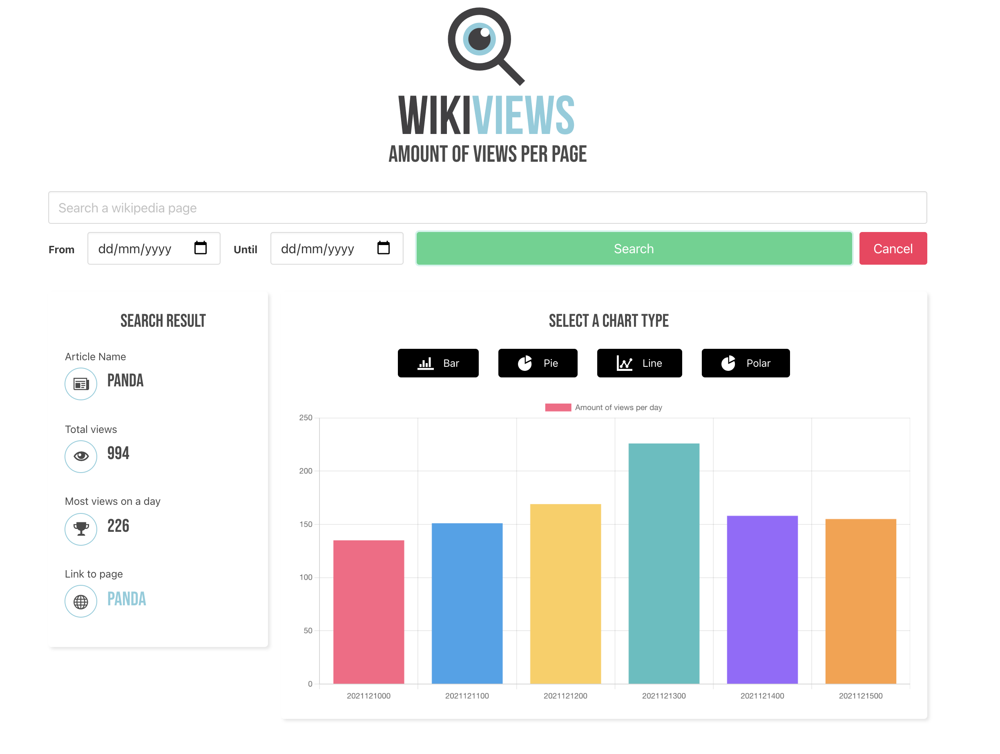
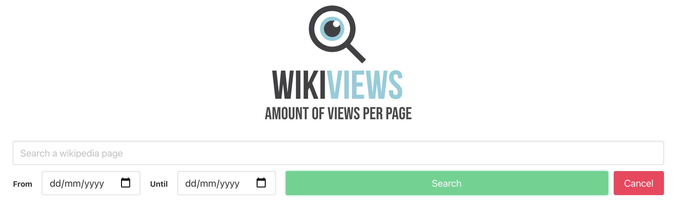
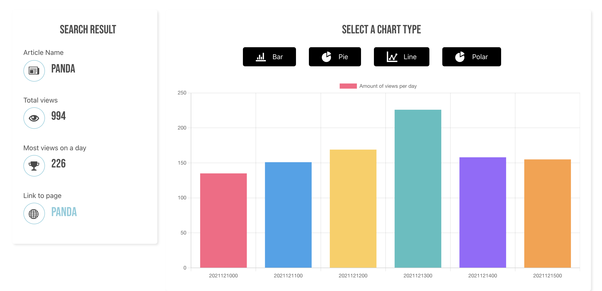

# WIKIVIEWS

Wikiviews is a webapp where you can search the amount of views per page on wikipedia.
The info that you get will be shown in a chart.

## HOW TO USE

1. Give a value in the search bar.
2. pick a start- and enddate.
3. Submit your search.
4. Change the type of chart
5. Go to the wikipedia page.

## WHAT IS THE DATA

1. Name of the page you searched
2. Total of views between start- and enddate.
3. The most views on one day.
4. The URL to the wikipedia page.

## TYPE OF CHART

You can choose between four different types of charts to show the data.

1. Bar chart
2. Line chart
3. Pie chart
4. Polar chart

