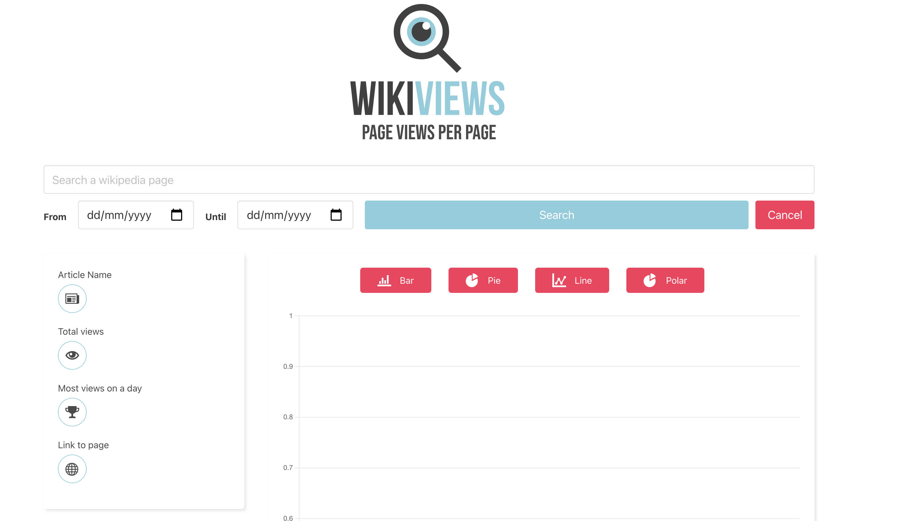

# WIKIVIEWS

Wikiviews is a webapp where you can search how many views a page on wikipedia has.
Search for a page give a date and get the number of views.

    

## HOW TO USE

Give a value in the search bar, pick a start- and enddate
